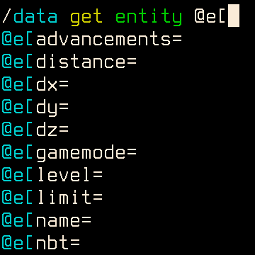

# JLine for Minecraft Dedicated Server

A server side fabric mod to enable command history, auto completion and syntax
highlighting on the server console. Should have zero impact on the gameplay.

Note: Since Minecraft 1.17 the `-Dlog4j.skipJansi=false` command line argument is needed for `%style`/`%highlight` log output (syntax highlighting is unaffected).

This mod is configurable with `jline4mcdsrv.toml` in the `config` folder:
* `logPattern` is the pattern used for Log4J2 (documentation [here](https://logging.apache.org/log4j/2.x/manual/layouts.html#Patterns))
* `highlightColors` is a list of colors used to highlight parameters in order
   (see image above for an example)

This is my first mod for Minecraft. Actually this is also the first time for me
to do anything serious using Java. So please be gentle if you want to roast my
code.

## Downloads
The mod can be downloaded for Minecraft 1.16 onwards on [CurseForge](https://www.curseforge.com/minecraft/mc-mods/jline-for-minecraft-dedicated-server/files)

  
Debugging/running with IntelliJ

### Setup
1. Fork and setup like any other Minecraft mod
2. Run Server configuration, accept EULA, ensure it runs successfully
3. Create debug.bat (or .sh)
4. paste the first line from the Server run log (the one that expands to oblivion when clicked ("C:...")) into there, append _new line_ `pause` if you want to see crashes
If the line is less than a thousand characters, something is wrong => Edit run configuration -> Shorten command line: `none`; and rerun
#### For debug
5. Edit Configurations... / Add New Configuration / Remote JVM Debug -> Transport=Shared Memory, Address=localhost:25555 (not tested other values, but address should be filled), Use module classpath=main.
6. Copy Command line arguments for remote JVM and paste into the beginning of debug.bat replacing existing agentlib config

- Don't forget to add `-Dlog4j.skipJansi=false` to script and save it

### Debug loop
1. Build
2. Run debug.bat
3. Start debugger
4. Debug
5. Close (cmd) manually

### Note
Each time launching `Minecraft Server` configuration changes the first line a bit, so you might need to update stuff after agentlib config in the script.
- Definetely update after adding new files

